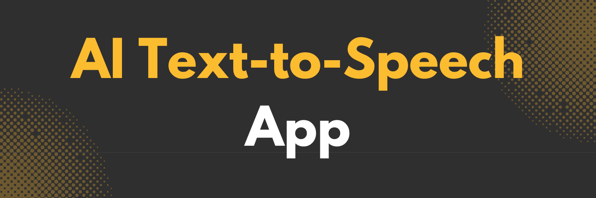

<div align="center">
  <br />
    <a href="https://youtu.be/JgoWMTa0pa4" target="_blank">
      
    </a>
  <br />

  <div>
    
    
    
    
  </div>

  <h3 align="center">AI Text-to-Speech (TTS) App</h3>

<div align="center">
     Build this project step by step with a detailed tutorial on <a href="https://www.youtube.com/@codespirit369/videos" target="_blank"><b>Code Spirit</b></a> YouTube. 
    </div>
</div>

## 📋 <a name="table">Table of Contents</a>

1. 🎬 [Introduction](#introduction)
2. ⚙️ [Tech Stack](#tech-stack)
3. 🔋 [Features](#features)
4. 🚀 [Quick Start](#quick-start)
5. 🕸️ [Snippets (Code to Copy)](#snippets)

## 🚨 Tutorial

This repository contains the code corresponding to an in-depth tutorial available on our YouTube channel, <a href="https://www.youtube.com/@codespirit369/videos" target="_blank"><b>Code Spirit</b></a>.

<a href="https://youtu.be/JgoWMTa0pa4" target="_blank"></a>

## <a name="tech-stack">⚙️ Tech Stack</a>

- React.js
- Next.js
- Typescript
- TailwindCSS
- ElevenLabs API
- ShadCN

## <a name="introduction">🎬 Introduction</a>

Welcome to the AI Text-to-Speech app! This web application allows you to convert any entered text into realistic, high-quality speech using the ElevenLabs API. Choose from a variety of voices and download the generated audio directly for your personal or professional use.

## <a name="features">🔋 Features</a>

👉 **Text-to-Speech Conversion**: Enter any text and generate speech using multiple voice options provided by the ElevenLabs API.

👉 **Voice Options**: Choose from a variety of voices to suit your needs, whether it's for narration, storytelling, or other uses.

👉 **Audio Download**: Easily download the generated voice audio for offline use.

## <a name="quick-start">🚀 Quick Start</a>

Follow these steps to set up the project locally on your machine.

**Prerequisites**

Make sure you have the following installed on your machine:

- [Git](https://git-scm.com/)
- [Node.js](https://nodejs.org/en)
- [npm](https://www.npmjs.com/) (Node Package Manager)

**Cloning the Repository**

```bash
git clone https://github.com/code-spirit-369/text-to-speech-yt
cd text-to-speech-yt
```

**Installation**

Install the project dependencies using npm:

```bash
npm install
```

**Set Up Environment Variables**

Create a new file named `.env.local` in the root of your project and add the following content:

```env
ELEVENLABS_API_KEY=
```

Get your API key from [ElevenLabs](https://elevenlabs.io/).

**Running the Project**

```bash
npm run dev
```

Open [http://localhost:3000](http://localhost:3000) in your browser to view the project.

## <a name="snippets">🕸️ Code Snippets</a>

<details>
<summary><code>/lib/utils</code></summary>

```typescript
import internal from "stream";
import { twMerge } from "tailwind-merge";
import { clsx, type ClassValue } from "clsx";

export function cn(...inputs: ClassValue[]) {
  return twMerge(clsx(inputs));
}

export async function streamToBuffer(
  stream: internal.Readable
): Promise<Buffer> {
  const chunks: Uint8Array[] = [];
  for await (const chunk of stream) {
    chunks.push(chunk);
  }
  return Buffer.concat(chunks);
}
```

</details>
